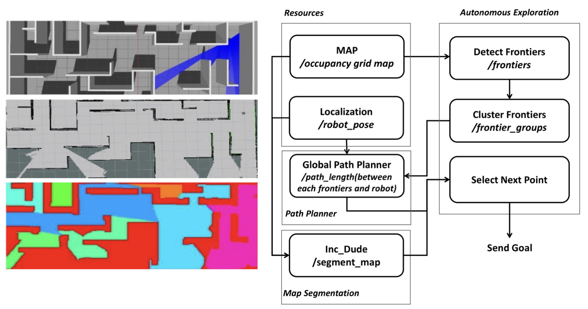
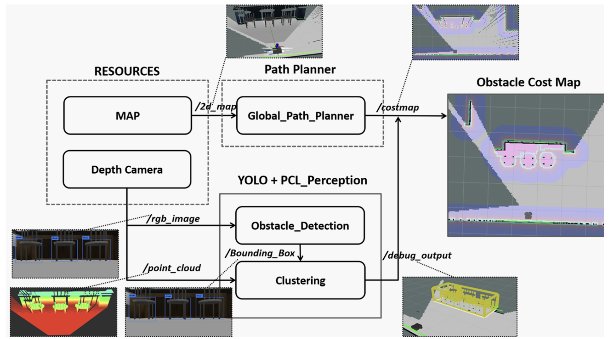
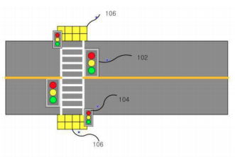
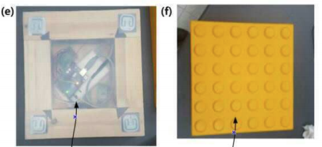
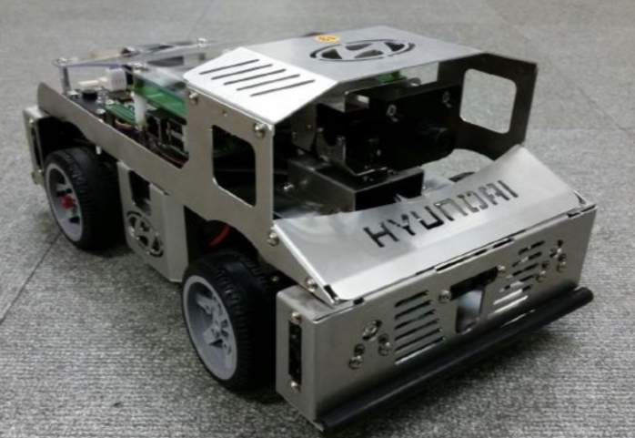
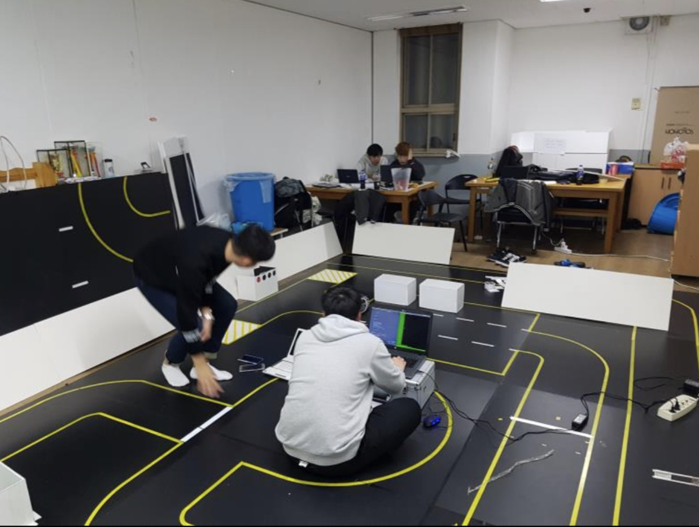
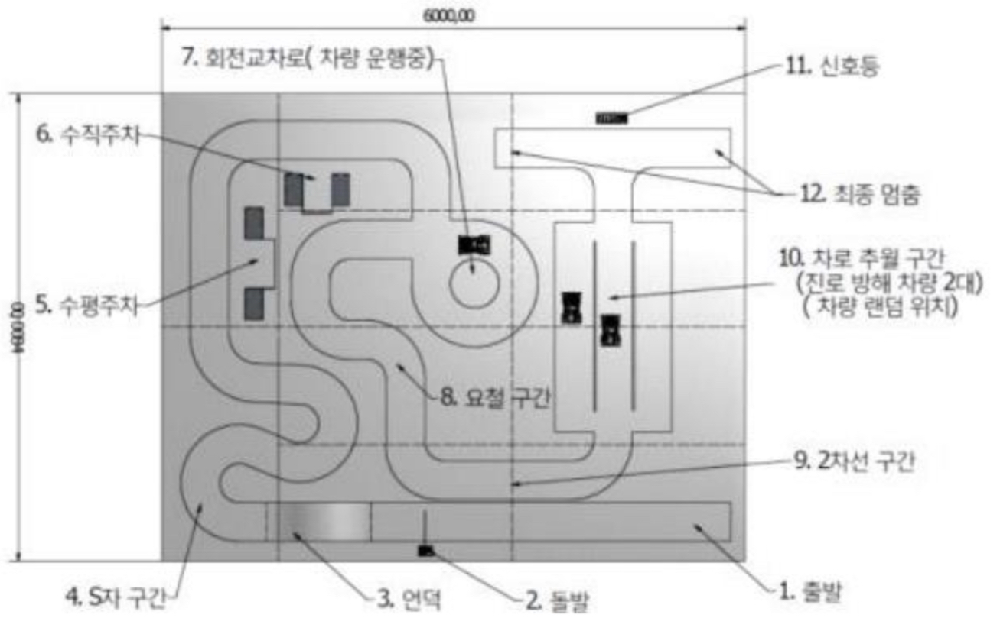

# PORTFOLIO

 
## INTRODUCE


- Name: Hyungseok,Kim
- Email : kty5989@gmail.com
- Github : [github.com/KimHyung](https://github.com/KimHyung)

```
Interested in autonomous system.
```
-----
## Education
-   Kyungpook National University(2019~2021), School of Electronics and Electrical Engineering(M.S)
-   Kyungpook National University(2012~2019), School of Electronics Engineering(B.S)

```
Study for Autonomous System
path planning, vehicle dynamics, robotics, slam.
```
  -----
## Skills
-   Language : C, C++, Python
-   Frameworks : ROS
-  Etc : Git, Slack

-----
## TODO
-   ROS2
  
----
## Projects



### Autonomous exploration
-   ***Introduce :*** Autonomous exploration strategy for a mobile robot with 2d-map segmentation and object detection in the cluttered environment.
-   ***Term :*** 2020.09~2021.7
-   ***Related technology :*** ros, frontier-based exploration, 2d-map segmentation, cost-function, yoloV3, costmap, pcl.
-   ***more detatils*** :  [github.com/KimHyung/autonomous_exploration](https://github.com/KimHyung/autonomous_exploration)
-   ***Result :*** IROS 2021 submit.


### 2020_autonomous_driving_contest
-   ***Introduce :*** 도로인프라와 연계된 실도로 기반 자율주행 경진대회, 차량 무선통신 인프라(WAVE)와 연계하여 실도로 기반의 “자율주행 픽업서비스” 미션 수행, Autoware.ai(ros1) 기반으로 자율주행 시스템을 개발하였고 실차(Soul – Hyundai)에 적용하였습니다.
-   ***Term :*** 2019.10~2020.10
-   ***Related technology :*** ros, c++, autoware, ndt-based slam, vector map, hybrid A*, pure-pursuit, v2x.
-   ***My role :*** path planning, path tracking, system integration, vector map creation.(contribution: 35%)
-   ***more detatils*** :  [github.com/KimHyung/autoware_carla](https://github.com/KimHyung/autoware_carla)
-   ***Result :*** [contest video](https://www.youtube.com/watch?v=usnD_GxowE0).




### 2019_capstone_design(smart sidewalk block)
-   ***Introduce :*** ‘무게센서 보도 블록을 이용한 스마트 신호등’은 무게센서를 이용해서 신호등의 사이클 타임을 제어하여 효율적으로 교통을 관리하며, 시각장애인이 보다 편리하고 안전하게 횡단보도를 이용할 수 있도록 도와주는 시스템이다.
-   ***Term :*** 2018.3~2019.1
-   ***Related technology :*** arduino, C, sensor data processing system.
-   ***My role :*** Team leader, PM, sensor data processing system.(contribution: 40%)
-   ***more detatils*** :  [특허정보-kportal](http://kportal.kipris.or.kr/kportal/search/total_search.do)
-   ***Result :*** 국내특허 출원.





### 2017_embeded_software_contest (자율주행 모형자동차 부문)
-   ***Introduce :*** KESSIA, KEIT가 주관하고 현대자동차가 후원하는 제 15회 임베디드 소프트웨어 공모전 자율주행 모형자동차 부문에 참여하였다. 모형자동차에 부착된 비전센서를 데이터를 기반으로 openCV라이브러리를 통해 차선, 정지선, 신호등 등을 인식하여 주행하는 자율주행 시스템을 개발하였다. 
-   ***Term :*** 2017.5~2017.12
-   ***Related technology :*** C, openCV.
-   ***My role :*** Team leader, PM, vision-based autonomous algorithm.(contribution: 40%)
-   ***Result :*** 결선 진출.
----

