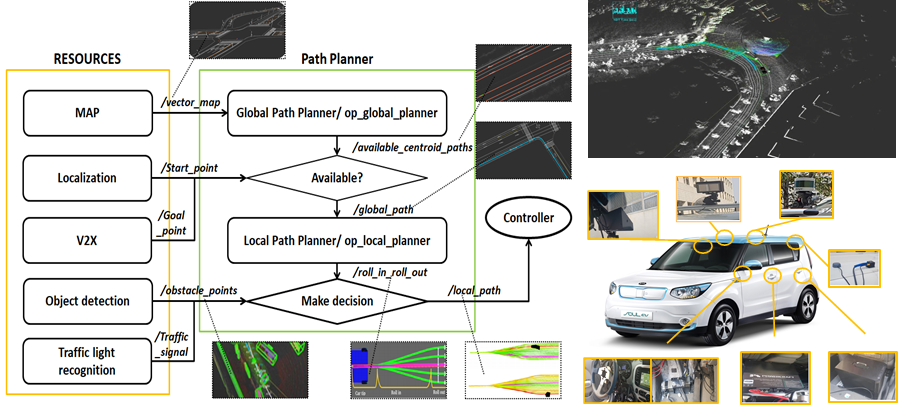
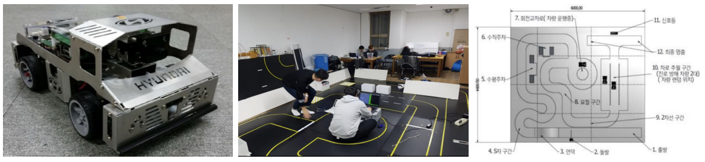

# PORTFOLIO

 
## INTRODUCE


- Name: Hyungseok,Kim
- Email : kty5989@gmail.com
- Github : [github.com/KimHyung](https://github.com/KimHyung)

```
Interested in autonomous system, path planning, robotics.
```
---
## Education
-   Kyungpook National University(2019~2021), School of Electronics and Electrical Engineering(M.S)
-   Kyungpook National University(2012~2019), School of Electronics Engineering(B.S)

#### 학위기간동안...

- N-wheeled robot의 동역학, 차량제어 그리고 자율주행 시스템에 대해 공부하였고 자율주행에 필요한 센서 또는 시스템 구성요소에 대한 전반적인 지식을 쌓았습니다. 

- 개발한 알고리즘을 실제 로봇에 적용하기전에 Gazebo, Carla, Autoware 그리고 Airsim 등 다양한 시뮬레이터를 이용하여 알고리즘의 성능을 검증 및 테스트 할 수 있습니다.

- 개발한 알고리즘을 실제환경에서 실험하기 위해 turtlebot3, LEO, OMO robot과 같은 다양한 로봇 플랫폼을 사용하였습니다.

- YOLO--based, RCNN-based, openCV-based 와 같은 객체 인식 및 추적 알고리즘에 대해 공부하였고 실습하였습니다.
---
## Publications
### Domestic
-  김형석, 이현범 "효율적인 프론티어 선정을 통한 모바일 로봇의 자율 탐사 및 의미지도 작성 기술", 제어.로봇.시스템학회 논문지, 2020
### Conferences
- Seon-il Lee, Hyungseok Kim, Uikyum Kim, Heyonbeom Lee, "Concave Wall Surface Tracking for Aerial Manipulator Using Contact Force Estimation Algorithm", 20th International Conference on Control, Automation and Systems, Busan, Korea (Oct.2020)
- Hyungseok Kim, Hyeonbeom Lee, "Autonomous exploration with efficient frontier detection", KROS 2020, pyeongchang, Korea, (Aug.2020)
---

## Skills
-   Language : C, C++, Python
-   Frameworks : ROS
-  Etc : Git, Slack

---
## TODO
-   ROS2
  
---
## Projects


### Autonomous exploration
-   ***Introduce :*** Autonomous exploration strategy for a mobile robot with 2d-map segmentation and object detection in the cluttered environment.
-   ***Term :*** 2020.09~2021.7
-   ***Related technology :*** ros, frontier-based exploration, 2d-map segmentation, cost-function, yoloV3, costmap, pcl.
-   ***more detatils*** :  [github.com/KimHyung/autonomous_exploration](https://github.com/KimHyung/autonomous_exploration)
-   ***Result :*** IROS 2021 submit.



### 2020_autonomous_driving_contest
-   ***Introduce :*** 도로인프라와 연계된 실도로 기반 자율주행 경진대회, 차량 무선통신 인프라(WAVE)와 연계하여 실도로 기반의 “자율주행 픽업서비스” 미션 수행, Autoware.ai(ros1) 기반으로 자율주행 시스템을 개발하였고 실차(Soul – Hyundai)에 적용하였습니다.
-   ***Term :*** 2019.10~2020.10
-   ***Related technology :*** ros, c++, autoware, ndt-based slam, vector map, hybrid A*, pure-pursuit, v2x.
-   ***My role :*** path planning, path tracking, system integration, vector map creation.(contribution: 35%)
-   ***more detatils*** : <strike>[github.com/KimHyung/autoware_carla](https://github.com/KimHyung/autoware_carla)</strike>
-   ***Result :*** [contest video](https://www.youtube.com/watch?v=usnD_GxowE0).


### 2019_capstone_design(smart sidewalk block)
-   ***Introduce :*** ‘무게센서 보도 블록을 이용한 스마트 신호등’은 무게센서를 이용해서 신호등의 사이클 타임을 제어하여 효율적으로 교통을 관리하며, 시각장애인이 보다 편리하고 안전하게 횡단보도를 이용할 수 있도록 도와주는 시스템이다.
-   ***Term :*** 2018.3~2019.1
-   ***Related technology :*** arduino, C, sensor data processing system.
-   ***My role :*** Team leader, PM, sensor data processing system.(contribution: 40%)
-   ***more detatils*** :  [특허정보-kportal, 10-2225213-0000](http://kportal.kipris.or.kr/kportal/search/total_search.do)
-   ***Result :*** 국내특허 출원.



### 2017_embeded_software_contest (자율주행 모형자동차 부문)
-   ***Introduce :*** KESSIA, KEIT가 주관하고 현대자동차가 후원하는 제 15회 임베디드 소프트웨어 공모전 자율주행 모형자동차 부문에 참여하였다. 모형자동차에 부착된 비전센서를 데이터를 기반으로 openCV라이브러리를 통해 차선, 정지선, 신호등 등을 인식하여 주행하는 자율주행 시스템을 개발하였다. 
-   ***Term :*** 2017.5~2017.12
-   ***Related technology :*** C, openCV, ECU.
-   ***My role :*** Team leader, PM, vision-based autonomous algorithm.(contribution: 40%)
-   ***Result :*** 결선 진출.
---
<!-- ## 지인 평가
 ### [양한솔](https://github.com/hansol-yang)(IOS/Android Front Developer, [SonsSoft](https://www.engflip.com/))
> 이새끼 졸라 잘함 걍 잘함 진영이 인정?
### [박진영](https://www.linkedin.com/in/%EA%B4%91%EC%88%98-%EC%8B%A0-202b63146)(Autosar Developer, [Fandom Inc.]()))
>ㅇㅇ ㅇㅈㅇㅈ -->

<!--### [김동진](https://github.com/deeean/)(Backend Developer, [Kakao Bank]())
> 뛰어난 커뮤니케이션을 바탕으로 도메인에 대한 이해를 매우 중요시하며 디자이너가 가질법한 섬세함까지 삼위일체를 가지고 있는 개발자라 생각합니다.

### [천보경](https://github.com/githubrat/)(DDD domain Developer, [RIDI]())
> 해커톤 마니아. <br> 골치아픈 이슈들이 생겼을 때 여러번 도움을 받은 경험이 있습니다. 여러 상황에서 생길만한 이슈대응능력이 좋습니다.
> <br> 관심갖는 모든 영역에 깊게 파고 듭니다.

### [주승환](https://github.com/philographer/)(Backend Developer, [Naver Line Inc.]())
> Fast Learner<br/>
> 같은 소프트웨어 마에스트로 활동했던 동기, 그리고 해커톤 파트너로서 바라본 `JSpiner`는<br/>
> 자신의 코드에서 개선할 점을 끊임없이 알아내려고 하며 빠르고 능동적으로 학습하는 멋진 개발자입니다.<br/>
> 뿐만 아니라 주변 지인들로부터 항상 배우려는 자세와 태도를 가지고 있어서 앞으로의 성장이 더 기대됩니다.

### [최본관](https://github.com/jangjunha/)(sw system Deveoper, [LG 전자]())
> 개발자로서도 팀원으로서도 함께하고 싶은 사람입니다.

### [정재욱](https://github.com/gglns94)(system engineer, [Samsung 전자]())
> 1. 커뮤니케이션에 공을 들이는 게 느껴지는 사람. 섬세한 설명과 좋은 질문으로 함께 일 할 때 편하고 기분이 좋아지는 사람.
> 2. 개발자로서, 팀의 구성원으로서 자신과 환경을 지속적으로 개선하고자 하는 의지가 보이는 사람.
> 3. 귀엽다. -->
---
 